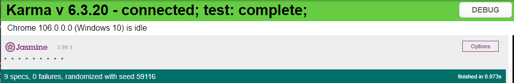

# Bestseat

BestSeat se trata de um projeto web que tem a proposta de permitir
que se possa assistir cursos de formas gratuitas. Na plataforma é
possivel cadastrar novos cursos, e usuarios. Com o cadastro realiazado
o usuario podera acompanhar seu progresso durante os uso da plaraforma.

## Requisitos

Para o uso da plataforma é necessario:
- `node 16`

## Rodando aplicação

Certificado que os requisitos estão configurados é necessario
rodar os seguintes comandos:
- `npm i` responsavel por instalar todas as dependencias do projeto
- `ng serve` responsavel por inicializar a aplicação comumente na 
no link `http://localhost:4200/`

## Rodando testes

Para realizar o testes configurados no projeto basta rodar
o seguinte comando (teste unitario via [Karma](https://karma-runner.github.io)):
- `ng test`
  
Ultimo teste relizado:

## Versionamento

O versionamento da aplicações pode ser econtrado nos arquivos
de environment encontrado na pasta environments `src/environments`

A versão é separada em MAJOR, MINOR e PATCH

> - PATCH: Qualquer iteração, algum bug corrigido, alguma otimização.
> - MINOR: Nova funcionalidade foi adicionada ao software, porém sua proposta básica continua a mesma.
> - MAJOR: Significa que algo da versão anterior pode “quebrar” na nova versão.

### Versão 0.6.0
